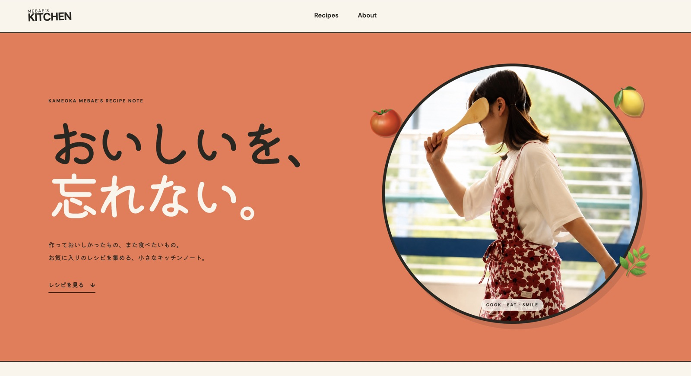
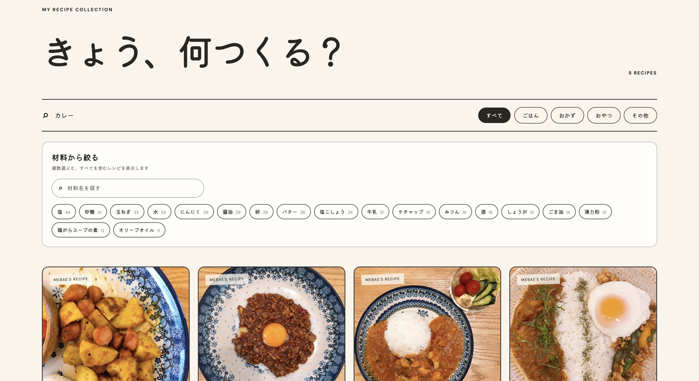
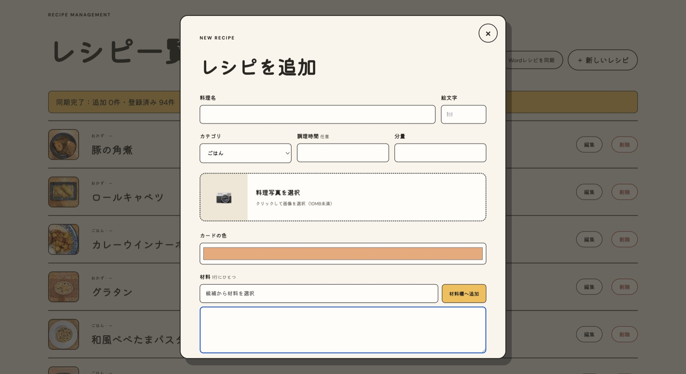

# Mebae's Kitchen

亀岡芽生のレシピをまとめる、React + TypeScript製のポートフォリオ／レシピサイトです。

公開サイト: [https://mebataro.web.app](https://mebataro.web.app)

## UI

### メインページ





### 管理者画面



## 開発

```bash
npm install
npm run dev
```

## Firebase

- Hosting: Reactアプリ
- Firestore: レシピデータ
- Storage: レシピ画像
- Authentication: 管理画面のメール／パスワード認証

```bash
npm run build
firebase deploy
```
